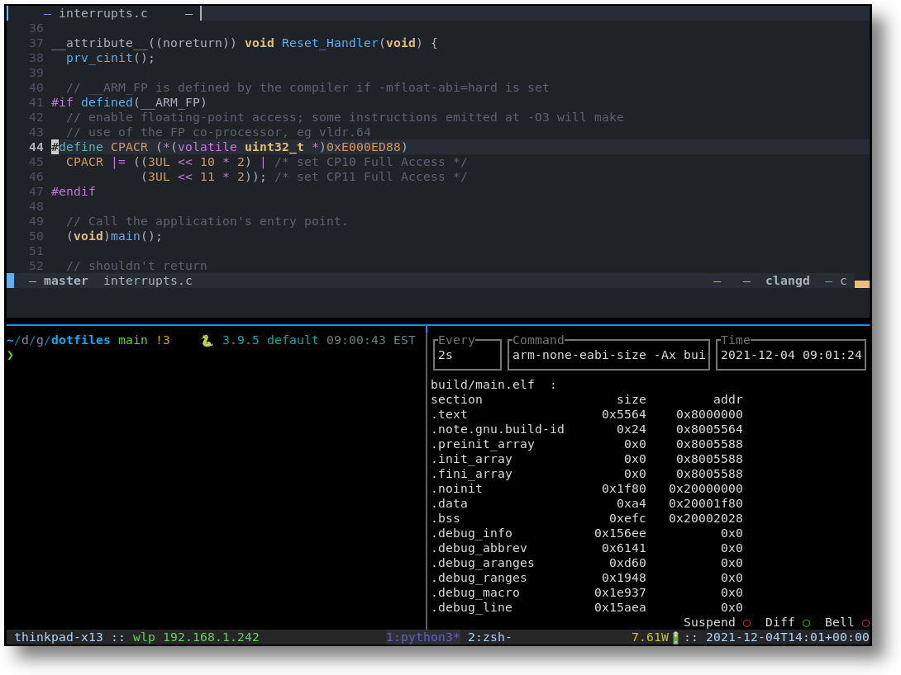

# Dotfiles

[](https://github.com/noahp/dotfiles)
[](https://github.com/noahp/dotfiles/actions)

<!-- markdown-toc-cli -->

- [Dotfiles](#dotfiles)
  - [Install dotfiles](#install-dotfiles)
  - [Feature highlight](#feature-highlight)
  - [Customization](#customization)
    - [`~/.gitconfig` -\> `~/.gitconfig-local`](#gitconfig---gitconfig-local)
    - [Multiple github ssh keys](#multiple-github-ssh-keys)
    - [`~/.zshrc` -\> `~/.zshrc_local`](#zshrc---zshrc_local)
    - [`~/.ssh/config`](#sshconfig)
  - [Manual steps](#manual-steps)
    - [direnv](#direnv)
      - [direnv virtualenvs](#direnv-virtualenvs)
    - [fd](#fd)
    - [font](#font)
    - [fzf](#fzf)
    - [git-status-tree](#git-status-tree)
    - [gnome-weather in top bar](#gnome-weather-in-top-bar)
    - [kitty](#kitty)
    - [ripgrep](#ripgrep)
    - [python virtualenv](#python-virtualenv)
    - [vs code multi cursor](#vs-code-multi-cursor)
    - [ydiff](#ydiff)
  - [Reference](#reference)
    - [cyrus-gdb](#cyrus-gdb)

<!-- markdown-toc-cli-end -->

## Install dotfiles

Run

```bash
# just set up symlinks
./install

# or to also install apt/zsh plugins/vscode extensions
./install-all
```

That won't overwrite any existing dotfiles. You'll have to relocate any
collisions manually before running the install script if you want the ones in
this repo (see [`install.conf.yaml`](install.conf.yaml) for which links are
added).

## Feature highlight

This is mostly used for me to sync prompt configuration/plugins and
.gdbinit/vim config between computers.

Rough list of features (might not be updated):

- oh-my-zsh (zsh plugin framework and lots of aliases)
- powerlevel10k (fast zsh prompt theme)
- cyrus gdb dashboard (featureful gdb dashboard)
- tmux config
- LunarVim config

Probably the most opinionated thing is the powerlevel10k config.. see
[`zsh/.p10k.zsh`](zsh/.p10k.zsh) for customizing. That theme also has a
customization wizard, see https://github.com/romkatv/powerlevel10k . It also
updates a lot so this might break... definitely make an issue if it fails for
you!

[](.assets/pics/kitty-tmux-example.png)

## Customization

Fork this repo :grinning: .

There are a few spots where I insert host-specific configs.

### `~/.gitconfig` -> `~/.gitconfig-local`

To specify local host settings, the [`~/.gitconfig`](git/.gitconfig) will
include `~/.gitconfig-local`. I use this to apply certain user name+email
settings based on file system location
(see https://git-scm.com/docs/git-config#_conditional_includes):

```bash
# in ~/.gitconfig-local:
[user]
    name = Noah Pendleton

[includeIf "gitdir:~/dev/work/"]
    path = ~/dev/work/.gitconfig
[includeIf "gitdir:~/dev/github/"]
    path = ~/dev/github/.gitconfig

# in ~/dev/work/.gitconfig:
[user]
    email = my-email@work.com

# in ~/dev/github/.gitconfig:
[user]
    email = my-email@noreply.github.com
```

After you set this up, you can verify it with `git config --list`.

### Multiple github ssh keys

If you want to use a separate key for git operations to a github organization,
this is one way to do it; override the ssh command for a particular directory.

In the work-specific directory's gitconfig (eg `~/dev/work/.gitconfig`):

```bash
[core]
    sshCommand = "ssh -i ~/.ssh/id_rsa.work.pub"
```

_Note_ that we need to use the public part of the identity file to have
ssh-agent properly select it with the `-i` argument to ssh. By default, `-i`
will just add the extra file to the keys ssh-agent tries when connecting to the
remote, but what we want is to select a specific key only, since other keys may
allow the ssh connection to github but not be on the correct account for the
repo in question. If we use `IdentitiesOnly` it requires typing the passphrase
(if present) on each operation, because that bypasses ssh-agent. Using the
public key seems to have ssh-agent try it first (`explicit agent`). Generate a
public key from a private key with:

```bash
ssh-keygen -y -f ~/.ssh/id_rsa.work > ~/.ssh/id_rsa.work.pub
```

Also note that if you use `GIT_SSH_COMMAND` to enable debug etc. you'll also
need to provide the key argument. And this won't help with cloning outside of
that directory 😕.

### `~/.zshrc` -> `~/.zshrc_local`

The [`~/.zshrc`](zsh/.zshrc) file will source a file `~/.zshrc_local` near the
end, where I apply host-specific settings.

### `~/.ssh/config`

This file is not tracked in my dotfiles repo, because it's host-specific.

Just documenting what I do here as a reference, for selecting the correct ssh
keys for a host, set up `~/.ssh/config`:

```bash
# use a non-default ssh key pair for github (id_rsa.github + id_rsa.github.pub)
Host github.com
  HostName github.com
  User git
  IdentityFile ~/.ssh/id_rsa.github
  IdentitiesOnly yes
```

## Manual steps

_Note- at the moment deploying this config requires a few manual steps.
TODO #2 to make this more automatic._

### direnv

Set your environment when entering a directory, by placing a `.envrc` file into
that directory. I'm not using this as much anymore but it can be helpful.

> https://github.com/direnv/direnv#setup

#### direnv virtualenvs

`direnv` can also be used to select a python virtualenv based on directory
location, which can be useful if you have projects that benefit from a little
isolation, or require different python interpreters; it can save some
typing/confusion to have dedicated virtualenvs.

I put my virtualenvs in a folder `~/.virtualenvs`, so this wrapper is useful:

> https://github.com/direnv/direnv/wiki/Python#virtualenvwrapper

In the individual `.envrc` files, to enter a virtualenv:

```bash
# select ~/.virtualenvs/python3
layout virtualenvwrapper python3
```

### fd

Fast find replacement that honors .gitignore and hidden files by default. Way
more user-friendly.

> https://github.com/sharkdp/fd

```bash
cargo install fd-find
```

### font

Powerlevel10k suggested font-
https://github.com/romkatv/powerlevel10k/#recommended-meslo-nerd-font-patched-for-powerlevel10k

### fzf

Neat fuzzy searcher for terminal history and path searching.

> https://github.com/junegunn/fzf#using-git

```bash
git clone --depth 1 https://github.com/junegunn/fzf.git ~/.fzf
~/.fzf/install
```

### git-status-tree

Git status tree view.

```bash
sudo apt install -y ruby
# my configs assume this repo is located at ~/dev/github/git-status-tree
git clone https://github.com/knugie/git-status-tree.git
```

### gnome-weather in top bar

Requires either configuration in the gnome-weather application or enabling
location in gnome.

> https://ubuntuhandbook.org/index.php/2020/08/weather-clock-menu-ubuntu-20-04/

```bash
sudo apt install gnome-weather chrome-gnome-shell

# enable toggle here
xdg-open https://extensions.gnome.org/extension/1380/weather-in-the-clock/
```

### kitty

If you want to use kitty as default terminal in gnome (eg via `ctrl+alt+t`
keyboard binding), set it via:

```bash
gsettings set org.gnome.desktop.default-applications.terminal exec "$HOME/.local/kitty.app/bin/kitty"
```

kitty.conf is installed as part of `./install` . If the key binding isn't
working, try running this to see any error message:

```bash
journalctl -f _UID=$(id --user)
```

### ripgrep

Vastly faster grep replacement written in rust.

> https://github.com/BurntSushi/ripgrep

```bash
cargo install ripgrep
```

### python virtualenv

Somewhat tidier python environment management to avoid polluting system python
with all those rando pypi packages you love so much.

```bash
sudo apt install python-pip

# this adds the virtualenv command to ~/.local/bin . using pip will get the
# normal virtualenv utility, not the weird debian patched one
pip install --user virtualenv

# set up default env for our ~/.zshrc to activate on new shells
virtualenv --clear ~/.virtualenvs/default
```

### vs code multi cursor

`gsettings set org.gnome.desktop.wm.preferences mouse-button-modifier "<Super>"`

### ydiff

Somewhat nicer diffs, eg `diff -du <file1> <file2> | ydiff`

```bash
pip install ydiff
```

---

---

## Reference

### cyrus-gdb

[Nice featureful gdb-dashboard](https://github.com/cyrus-and/gdb-dashboard).
Tracked as a submodule in this repo.

**Note!** if debugging shared libraries in gdb that haven't been loaded yet, be
sure to run `set confirm off` to allow setting breakpoints on symbols that
haven't yet loaded.

> https://github.com/cyrus-and/gdb-dashboard
