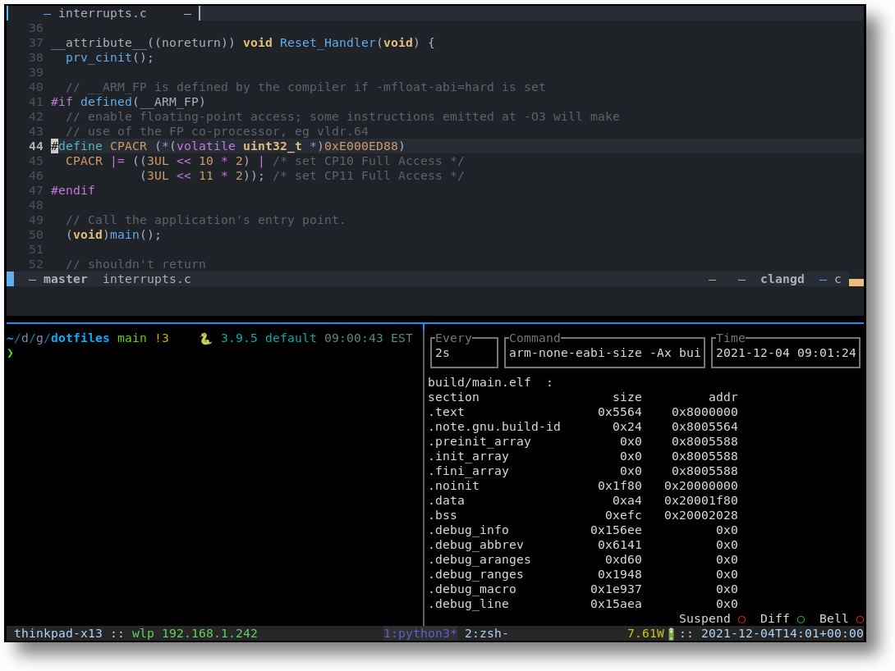

# Dotfiles

[](https://github.com/noahp/dotfiles)
[](https://github.com/noahp/dotfiles/actions)

## Install dotfiles

```bash
# just set up symlinks
./install

# or to also install apt/zsh plugins/vscode extensions
./install-all
```

That won't overwrite any existing dotfiles. Relocate any collisions manually
before running the install script if you want the ones in this repo (see
[`install.conf.yaml`](install.conf.yaml) for which links are added).

## Feature highlight

- oh-my-zsh (zsh plugin framework and lots of aliases)
- powerlevel10k (fast zsh prompt theme)
- cyrus gdb dashboard (featureful gdb dashboard)
- tmux config
- Neovim config (`vim/.vimrc` → `~/.config/nvim/init.vim`)

Probably the most opinionated thing is the powerlevel10k config - see
[`zsh/.p10k.zsh`](zsh/.p10k.zsh) for customizing. That theme also has a
customization wizard, see https://github.com/romkatv/powerlevel10k.

[](.assets/pics/kitty-tmux-example.png)

## Customization

Fork this repo.

There are a few spots where I insert host-specific configs.

### `~/.gitconfig` -> `~/.gitconfig-local`

The [`~/.gitconfig`](git/.gitconfig) will include `~/.gitconfig-local`. I use
this to apply user name/email settings based on filesystem location
(see https://git-scm.com/docs/git-config#_conditional_includes):

```bash
# in ~/.gitconfig-local:
[user]
    name = Noah Pendleton

[includeIf "gitdir:~/dev/work/"]
    path = ~/dev/work/.gitconfig
[includeIf "gitdir:~/dev/github/"]
    path = ~/dev/github/.gitconfig

# in ~/dev/work/.gitconfig:
[user]
    email = my-email@work.com

# in ~/dev/github/.gitconfig:
[user]
    email = my-email@noreply.github.com
```

After you set this up, verify with `git config --list`.

### Multiple GitHub SSH keys

To use a separate key for a particular directory, override the ssh command in
that directory's gitconfig (e.g. `~/dev/work/.gitconfig`):

```bash
[core]
    sshCommand = "ssh -i ~/.ssh/id_rsa.work.pub"
```

Using the public key file lets ssh-agent select it first without bypassing the
agent (which would require re-entering the passphrase each time). Generate a
public key from a private key with:

```bash
ssh-keygen -y -f ~/.ssh/id_rsa.work > ~/.ssh/id_rsa.work.pub
```

### `~/.zshrc` -> `~/.zshrc_local`

The [`~/.zshrc`](zsh/.zshrc) file will source `~/.zshrc_local` near the end,
for host-specific settings.

### `~/.ssh/config`

Not tracked in the repo (host-specific). Example for selecting the correct SSH
key for GitHub:

```bash
Host github.com
  HostName github.com
  User git
  IdentityFile ~/.ssh/id_rsa.github
  IdentitiesOnly yes
```

## Manual steps

### CLI tools

#### fd

Fast find replacement that honors `.gitignore` by default.

> https://github.com/sharkdp/fd

```bash
cargo install fd-find
```

#### fzf

Fuzzy searcher for terminal history and path searching.

> https://github.com/junegunn/fzf#using-git

```bash
git clone --depth 1 https://github.com/junegunn/fzf.git ~/.fzf
~/.fzf/install
```

#### ripgrep

Vastly faster grep replacement written in Rust.

> https://github.com/BurntSushi/ripgrep

```bash
cargo install ripgrep
```

#### uv

Fast Python package and project manager.

> https://docs.astral.sh/uv/

```bash
curl -LsSf https://astral.sh/uv/install.sh | sh
```

#### ydiff

Nicer diffs, e.g. `diff -du <file1> <file2> | ydiff`.

```bash
uv tool install ydiff
```

#### direnv

Set your environment when entering a directory, by placing a `.envrc` file into
that directory.

> https://github.com/direnv/direnv#setup

To activate a `uv`-managed virtualenv automatically:

```bash
# .envrc
uv venv && source .venv/bin/activate
```

### Terminal / editor

#### font

Powerlevel10k recommended font:
https://github.com/romkatv/powerlevel10k/#recommended-meslo-nerd-font-patched-for-powerlevel10k

#### kitty

`kitty.conf` is installed as part of `./install`.

To use kitty as the default terminal in GNOME (e.g. via `ctrl+alt+t`):

```bash
gsettings set org.gnome.desktop.default-applications.terminal exec "$HOME/.local/kitty.app/bin/kitty"
```

If the key binding isn't working, check for errors with:

```bash
journalctl -f _UID=$(id --user)
```

### Desktop (GNOME)

#### gnome-weather in top bar

Requires either configuration in the gnome-weather application or enabling
location in GNOME.

```bash
sudo apt install gnome-weather chrome-gnome-shell

# enable the extension
open https://extensions.gnome.org/extension/5470/weather-oclock/
```

#### gnome-clipboard-indicator

https://extensions.gnome.org/extension/779/clipboard-indicator/

#### VS Code multi cursor

```bash
gsettings set org.gnome.desktop.wm.preferences mouse-button-modifier "<Super>"
```

---

## Reference

### cyrus-gdb

[Nice featureful gdb-dashboard](https://github.com/cyrus-and/gdb-dashboard).
Tracked as a submodule in this repo.

**Note:** if debugging shared libraries that haven't been loaded yet, run
`set confirm off` to allow setting breakpoints on symbols that haven't loaded.

> https://github.com/cyrus-and/gdb-dashboard
